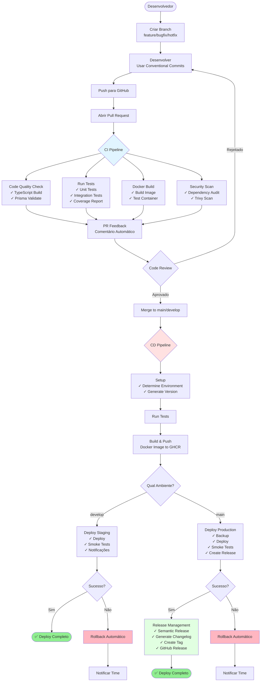

# Workflow de CI/CD - Diagrama Visual



## Legenda

### 🔵 CI Pipeline (Continuous Integration)
Executado em **Pull Requests** para validar código antes do merge.

### 🔴 CD Pipeline (Continuous Deployment)
Executado após **merge** para deploy automático.

### 🟢 Release Management
Executado em **main** para versionamento e publicação.

---

## Fluxo Detalhado por Etapa

### 1. Desenvolvimento (Developer)
```
┌─────────────────────────────────────┐
│ git checkout -b feature/nova-feature│
│ # Desenvolver código                │
│ git commit -m "feat: nova feature"  │
│ git push origin feature/nova-feature│
└─────────────────────────────────────┘
```

### 2. Pull Request
```
┌─────────────────────────────────────┐
│ • Preencher template                │
│ • Atribuir reviewers                │
│ • Adicionar labels                  │
│ • Aguardar CI checks                │
└─────────────────────────────────────┘
```

### 3. CI Pipeline (4-6 minutos)
```
┌─────────────────────────────────────┐
│ ✓ Code Quality Check (1-2min)      │
│ ✓ Run Tests (2-3min)                │
│ ✓ Docker Build (1-2min)             │
│ ✓ Security Scan (1-2min)            │
│ ✓ PR Feedback (10s)                 │
└─────────────────────────────────────┘
```

### 4. Code Review
```
┌─────────────────────────────────────┐
│ • Revisar código                    │
│ • Comentários e discussões          │
│ • Solicitar mudanças se necessário  │
│ • Aprovar PR                        │
└─────────────────────────────────────┘
```

### 5. Merge
```
┌─────────────────────────────────────┐
│ • Squash and merge (recomendado)   │
│ • Rebase and merge                  │
│ • Merge commit                      │
└─────────────────────────────────────┘
```

### 6. CD Pipeline (5-10 minutos)
```
┌─────────────────────────────────────┐
│ ✓ Setup (30s)                       │
│ ✓ Run Tests (2-3min)                │
│ ✓ Build & Push Image (2-3min)      │
│ ✓ Deploy (2-3min)                   │
│ ✓ Smoke Tests (30s)                 │
└─────────────────────────────────────┘
```

### 7. Release (apenas main)
```
┌─────────────────────────────────────┐
│ ✓ Semantic Release (1min)           │
│ ✓ Generate Changelog (30s)          │
│ ✓ Create Tag (10s)                  │
│ ✓ GitHub Release (20s)              │
└─────────────────────────────────────┘
```

---

## Tempo Estimado Total

| Etapa | Tempo |
|-------|-------|
| Desenvolvimento | Variável |
| CI Pipeline | 4-6 minutos |
| Code Review | Variável (30min-2h) |
| CD Pipeline | 5-10 minutos |
| Release | 2-3 minutos |
| **Total (sem review)** | **11-19 minutos** |

---

## Gatilhos de Workflow

### CI (ci.yml)
```yaml
Trigger: Pull Request
Branches: main, develop, feature/*, bugfix/*, hotfix/*
Paths Ignore: **.md, docs/**, .gitignore
```

### CD (cd.yml)
```yaml
Trigger: Push
Branches: main, develop
Manual: workflow_dispatch
```

### Code Quality (code-quality.yml)
```yaml
Trigger: Pull Request, Push
Branches: main, develop
Schedule: Toda segunda 9h UTC
Manual: workflow_dispatch
```

### Release (release.yml)
```yaml
Trigger: Push
Branches: main
Manual: workflow_dispatch (version bump manual)
```

---

## Ambientes

### Development (Local)
```
Branch: qualquer
Acesso: Desenvolvedor
Database: Local PostgreSQL
```

### Staging
```
Branch: develop
Acesso: Automático após merge
Database: PostgreSQL Cloud (Staging)
URL: https://staging-api.fiap-pos-tech.com
```

### Production
```
Branch: main
Acesso: Automático após merge + Aprovação
Database: PostgreSQL Cloud (Production)
URL: https://api.fiap-pos-tech.com
```

---

## Notificações

### Sucesso ✅
- Comentário no PR
- GitHub Release Notes
- Badge atualizado

### Falha ❌
- Comentário no PR com erro
- Email para autor
- Status check failed

### Rollback ⚠️
- Notificação urgente
- Comentário com detalhes
- Issue automática

---

**Última atualização:** 28/10/2025
